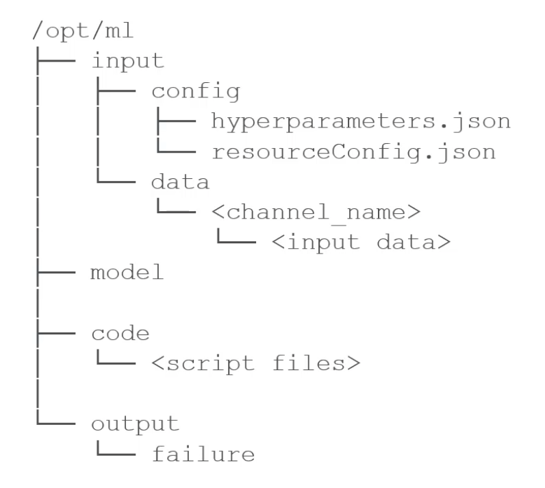
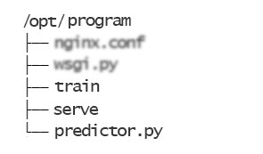

# My Notes for AWS ML Specialty Exam

Although I tried to take notes often through out my study of the exam and taking course, you should note that these notes are highly biased toward my previous knowledge of these concepts.

I highly recommend you start taking notes as you take online courses or take practice tests.

My approach was to study the mistakes of my practice exams and add missing knowledge to my notes, in an iterative manner.

# Data Engineering

## S3

* Security:
    * Resource based:
        * Object access control list (ACL) - finer grain
        * Bucket access control list -> less common, but can be used for:
            * Grant access to public
            * Force object to be encrypted
            * Cross account access
    * User based (IAM)
    * Relation to sagemaker:
        * Default iam role on sagemaker has access to bucket named sagemaker
        * Networking: vpc endpoint gateway -> allow traffic to stay in the same vpc -> avoid public web when using sagemaker
* Lifecycle policies:
        * Use lifecycle policies to move to infrequent access (IA) or glacier
        * Minimum 30 days for lifecycle policy to move data from standard to standard IA

## Kinesis

* Kinesis Streams
    * Low latency
    * Shards to be provisioned in advance
    * Retention: 24 hours default up to 7 days
    * Record max size 1 mb
    * Consumer: 2mb/s/shard, 5 tps/shard
    * Producer: 1mb/s/shard, or 1000 records/s/shard
    * SDKs
        * Kinesis Producer Library (KPL) -> uses PutRecords to produce data
            * Performance benefits (out of box thread/retry logic)
            * Producer monitoring
            * Async arch
            * Only not to use if very very sensitive to latency
        * Kinesis Client Library (KCL)  
            * Read data from the stream, associate shards with workers to consume data, checkpoints, etc.
* Kinesis Analytics
    * Real time analytics on streams using SQL or Flink
    * ETL on streaming data, MANAGED but not cheap
    * Source: kinesis data stream, Amazon MKS, S3
    * Destination: kinesis data stream, MKS, S3
    * IAM to access source/sink streams
        * Lambda for preprocessing (convert format, enrich data, filter data, etc) before running the SQL
    * ML on kinesis analytics
        * Random cut forest (RCF)
            * anomaly detection on NUMERICAL data
            * use recent history to compute model
        * Hotspots
            * Locate dense regions in a data
* Kinesis Firehouse
    * MANAGED load stream into data stores, s3, redshift, elasticsearch, splunk
    * Near real time min 60 seconds latency, autoscaling
    * Ingest from: aws sdk, kinesis data stream, kinesis agent, etc.
    * Load into: s3, redshift, api gateway, etc
    * Optional transformation through aws lambda -> csv to json
    * From csv/json to parquet/orc -> S3 target ONLY
    * Supports comparison (zip, gzip, snappy) -> S3 target ONLY
* Video stream
    * Manage live video
    * Data retention 1 hour to 10 years
    * 1 producer per stream
    * deeplens, rtsp camera, etc

## Glue

* Glue data catalog
    * Schema inference metadata for your data in s3
    * Feeds to athena, redshift, emr
    * Glue crawler builds data catalog
        * json, parquet, csv, relational store
        * on schedule or on demand
        * partitioning in s3 folders matters
* Glue ETL
    * Fully MANAGED, runs on serverless spark
    * Scripts in python, scala, spark, pyspark
    * CANNOT write into protobuf
    * Target to s3, jdbc (redshift or rds), or glue catalog
    * Glue scheduler to run on schedule
    * Glue trigger to run on events
    * Supported transformations
        * Basic: drop fields, drop null values, remove, filter, join, map
        * FindMatchesML: drop identical records if they don’t have exact id
        * Support conversions, csv, json, parquet, avro, orc, xml
        * Apache spark transformations supported, e.g. kmeans
    * Streaming GLUE ETL
        * Uses MANAGED spark streaming to continuously run ETL on streaming data

## Data pipelines

* MANAGED task deps, retries, failures, data source can be on premise
* **Unlike AWS steps**: Specialized workflow working with data where aws Steps is more general
* **Unlike glue**: needs to manage, control over env, compute resources, ec2, emr, code, etc.

## AWS batch

* MANAGED, run batch jobs as docker images
* Schedule via cloudwatch
* Orchestrate using aws step
* **Unlike glue**: general not just ETL, must provide docker image

## DMS (database migration service)

* Can move on-premise data into aws
* Homogeneous (mysql -> mysql) or heterogeneous (mysql -> postgres)
* Must create ec2 to perform migration
* **Unlike glue**: used to move data as it is to the aws db store

## Redshift

* OLAP, query petabyte scale data
* **Unlike RDS**: optimized for size of data rather than number of transactions
* Redshift spectrum enables querying directly from s3
* Use the redshift spectrum so that infrequently data in s3 can be queried.

## AWS step

* Orchestration
* Advanced try and error, audit, wait for arbitrary amount of time between tasks, max state machine 1 year.

# Exploratory Data Analysis

## Distributions

* Normal (Gaussian): continuous data which have a symmetric distribution -> pdf
* Poisson: counts discrete occurrences among a continuous domain -> pmf 
    * Example: Calls received in next hour
    * mean = variance
* Binomial: counts discrete occurrences among discrete trials -> pmf
    * Example: Coin toss
    * mean > variance
* Bernoulli -> special case of binomial with single trial n=1
* Univariate distribution relationships: http://www.math.wm.edu/~leemis/chart/UDR/UDR.html

## Athena

* MANAGED query data from s3 (presto under the hood)
supports csv, json, orc, parquet, avro, structured or unstructured
* Querying staging data before loading it to redshift
* Integration with odbc, jdbc, quicksight 
* How to optimize athena usage:
    * Partition the data
    * Bucket the data
    * Use compression of parquet or orc
    * Optimize file size, too many small files add overhead, if too many small file (< 128Mb) use `S3DictCP` to combine small files
* Pay as you go
    * Per TB scanned
    * Successful query and canceled ones are payed
    * No charge for creating/updating/deleting queries
    * Save money by having data in columnar format, orc, parquet
* Don't use athena for ETL (use glue) or viz (use quick sight)

## Quick sight

* MANAGED viz, dashboards
* Can do: kpis, stories, **anomaly detection**, auto-narratives, **forecasting**
* Sources: redshift, aurora, athena, ec2 based dbs, files in s3
* SPICE -> in memory parallel calculation (10gb by default), columnar format
* Anti-pattern:
    * ETL -> use glue instead
    * Highly formatted canned report -> just for ad-hoc query, analysis, and visualization
* Security: MFA, RLS, Private VPC

## EMR

* Managed hadoop on EC2
* EMR Nodes:
    * Master node: manages the cluster on a single ec2
    * Core node: host hdfs data and run tasks
    * Task node: run tasks, does not host data, good use of spot instances
* Available storage:
    * HDFS
    * EMRFS: S3 as if it is HDFS (dynamodb to track consistency), EMRFS consistent view
    * Local file system
    * EBS for HDFS
* Spark
    * Spark MlLib: classification (LR, Naive Bayes), regression, decision trees,  kmeans clustering, lda (topic modeling), svd, pca, etc.
    * Spark streaming -> from kinesis
* Zepplin -> notebook for spark
* EMR notebook -> jupyter for emr with more aws integrations
* Instances:
    * m4.large is good -> `m4.xlarge` if need more power or need more than 50 nodes
    * `t2.medium` if a lot of external deps -> crawler
    * C instances -> computational jobs
    * Spot instances -> use for task nodes (partial data loss for core/master node is instance shuts down prematurely)

## Feature Engineering

* Imputations
    * Simple approaches (mean, median, mode, remove):
        * Mean -> Simple solution
        * Median -> if outliers are present or data is skewed
        * Mode -> for non numerical values
        * Remove -> usually not the answer
    * KNN -> works only with numerical data, most similar rows -> hamming distance can be used with categorical data but better served by NN
    * Deep learning -> works with categorical -> complicated
    * Regression: find linear and non linear relationship between missing feature and other features -> MICE 
    * Time series:
        * Last observation carried forward (LOCF)
        * Next observation carried backward (NOCB)
* Dealing with unbalanced data
    * Oversampling
    * Under-sampling -> not the right answer, only when big data scaling issue
    * SMOTE -> create minority class artificially using KNN
        * Runs knn for each sample of minority class
        * Generates new sample from knn results and under-samples majority class
        * Better than oversampling
        * Faster than GAN, but GAN in general does better
    * GAN -> generate unique observation that represent minority class
    * Adjusting threshold -> guaranteed to reduce false positives, but at the cost more false negatives
* Outliers
    * Detect with box whisker plot, or two quantile
    * Detect with random cut forest -> quicksight, kinesis data analytics, sagemaker, etc.
* Techniques
    * Binning
        * Quantile binning -> evenly populated (distributed) bins
        * Interval binning -> evenly sized bins
    * Transforming
        * Super and sublinear functions
    * Encoding
        * One hot encoding for categorical data
        * Categorical encoding for ordinal data (the weight is important)
    * Scaling 
        * When a model depends on the distance we scale, e.g. SVD, KNN. On the other hand tree based methods do not care about scaling
        * Techniques:
            * Normalization: Features scaled to end up between 0 and 1 -> min-max scaler
                * For algorithms that do not care about data distribution
            * Standardization: Features are scaled to zero mean and unit std -> z = (x - mu) / std
                * Algorithms that assume data is having Gaussian distribution
                * Outliers do not get affected by the standardization.
                * Robust standardization is better when we have outliers. Does not consider outliers in mu and std
    * Shuffling
        * Bad result if not shuffled enough
* NLP techniques
    * Preprocessing:
        * Stemming: removing rule based suffixes, e.g. ing, es, etc.
        * Stop words: removing words that have no relevance to context of data, e.g. am, is, are, etc.
        * Object standardization: removing stuff like acronyms, hashtags, slang not recognized, etc.
    * N-gram: word windowing
    * TF-IDF (term frequency-inverse document frequency)
        * How many times a word occurs in a document (term freq/doc freq)
        * Assumes doc is a bag of words (bag of words is order-less)
        * unigram, bigrams, n-grams.
        * td-idf matrix -> dimension (docs, n-grams)
    * OSB (orthogonal sparse bi-gram)
        * Alternative to N-grams: Find common word combinations repeated through 
        * Example for OSB size 4: the_quick, the__brown, the___fox, quick_brown, quick__fox, etc.
        * OSB(var1, 5) -> compute OSB for var1 and window size 5

## Grand Truth

* Reduces cost by learning and only sending stuff for human labeling that model is not sure about
* Also supports: mechanical turk, internal team, professional services
* Generate training data
    * Rekognition -> image recognition
    * Comprehend -> topic modeling, classify by topics, sentiments
    * Any pre-trained model or unsupervised model to label stuff

# Modeling

## Neural Network

* Activation function: non-linear activation: allow backprop, deep
    * Sigmoid/logistic -> scales from 0 to 1 -> (computationally expensive, vanishing gradient problem)
    * Sigmoid -> if you want to apply to more than one classification
    * Tanh -> scales from -1 to 1 -> vanishing gradient problem (computationally expensive, preferred over sigmoid)
    * ReLU -> popular, fast to compute -> Prone to dying relu problem (linear activation problem when negative or near zero)
    * Leaky ReLU -> solves relu dying problem by having negative slope.
    * ELU (exponential linear unit)
    * Swish -> From google not amazon
    * Maxout -> not very practical, double parameters to train
    * Softmax -> final layer, converts probabilities to classification
        * Can be used for multi-classification as the last layer of network
        * Can NOT produce more than one label for a prediction (sigmoid can)
    * How to choose:
        * Multiple classification -> softmax
        * RNN -> tanh
        * Anything else -> start with relu, then if not good leaky relu, last resort prelu, maxout, very deep networks swish

## RNN

* Seq-to-seq, e.g. stock price prediction
* Seq-to-vec, e.g. words in sentence to sentiment
* Vec-to-seq, e.g create caption from image
* enc -> decoder -> seq-to-vec-to-seq, e.g. translation
* Algorithms
    * LSTM -> separate short term and long term states, solves vanishing gradient problem
    * GRU (gated recurrent unit) -> simplified lstm -> performs as well

## Learning Rate and Batch Size

* Small batch size does not get stuck in local minima
* Large batch size can get stuck in local minima -> can converge at wrong solution at random -> inconsistent results from run to run
* Large learning rate -> overshoot (outliers will affect the overshoot)
* Small learning rate -> increased training time

## Bias-variance trade of

* Dropout
* Early stopping -> we stop when loss is getting larger than median previous epoch losses
* L1 -> sum of weights, sparse output, computationally inefficient, random feature selection
    * Good candidate if you want to drop features
* L2 -> sum of sq weights, efficient, dense output

## How to solve vanishing gradient problem

* Multi-level training -> train sub networks individually
* LSTM
* Residual networks
* Better activation function -> Relu
* Gradient checking: numerical check the derivatives in training

## Model metrics

* Precision = Positive predictive value  = TP / (TP+FP)
    * E.g. Fraud detection
    * Predicting wrong is the worst outcome
* Recall = Sensitivity = true positive rate = TP / (TP + FN) = TP / P
    * E.g. Cancer detection
    * Not predicting right is the worst outcome
* Specificity = True negative rate = TN / (TN + FP)
* F1 harmonic mean of recall and precision = (2 * Precision * Recall) / (Precision + Recall)
* RSME -> For regression
* Residuals -> exploring the regression behavior, finding bias/variance in fit
* ROC curve -> True Positive Rate vs False Positive Rate -> AUC area under curve of ROC
    * For multi-class classification, we can calculate AUC for one-vs-all or one-vs-one
    * AUC one vs all e.g. avg(AUC_class1, AUC_class2, …)
* Precision-Recall curve -> Better than ROC when classes are imbalanced

## Bagging vs Boosting

* Bagging -> randomly sampling with replacement
    * Avoids over-fitting
    * Can be easily parallelized
    * Example, random forest
* Boosting -> take previous prediction into account for new prediction
    * Better accuracy
    * Example, xgboost

## Sagemaker

* Two patterns:
    * Batch transformation
        * Long running
        * Inter node communication in batch job does not go through internet.
    * Online Inference endpoint
        * Inference as API call
        * Ideal input is record io protobuf
        * Either Built in algo, code on top of tensorflow, pytorch, mxnext, bring your own code/docker, or buy algorithm
* Requirements:
    * Sagemaker training requirements
        * Specify resources, instances, ML storage
        * ARN of IAM role
        * Output path on S3 to persist the model
    * Persistent inference endpoint requirements
        * HTTP request
        * 250ms accept connection 
        * Respond on inference within 60 seconds
        * `/invocations` on port 8080
        * `/ping` to return 200
        * Sagemaker endpoint steps:
            * Create model
            * Create endpoint config for https endpoint
            * Create https endpoint

## Linear learner

* Can handle:
    * Regression
    * Classification -> a linear threshold is used, can do multi-class or binary
* Inputs formats:
    * Record io protobuf, float32
        * Example header format: `content-type=application/x-recordio-protobuf`
    * CSV, first column assumed target
        * Example header format: `content-type=text/csv;label_size=1`
            * content-type: The format of input data
            * label_size: number of target (label) columns 
* Notes:
    * Data must be normalized, do it yourself or tell the algorithm
    * Data must be shuffled
    * Can offer multiple optimization, multiple model training, l1, l2 tuning
    * Choose best model based on validation data
        * By default automatic model tuning is turned off, sets parallel models, `num_models` to 1.
    * File mode vs pipe mode
        * Pipe mode is more efficient, data needs to be record io
* Hyperparams:
    * `predictor_type` (required -> options: `binary_classifier`, `multiclass_classifier`, `regressor`)
    * `num_classes` (required when `predictor_type=multiclass_classifier`)
    * `balance_multiclass_weights` -> equal importance in weight function
    * `weight_decay` -> L2 regularization
* Compute:
    * (PARALLELIZABLE) single or multi machine cpu or gpu
    * Multi-gpu is useless

## XGBoost

* Input formats:
    * Libsvm, csv
    * AWS made parquet and record io protobuf also available
* Hyperparams
    * `num_class` -> (required if objective is `multi:softmax` or `multi:softprob`)
    * `num_round` (required)
    * `sub_sample` -> avoids overfitting in xgboost
    * `eta` -> step size shrinkage -> prevents overfitting
    * `gamma` -> min loss reduction -> larger value is more conservative
    * `alpha` -> l1
    * `lambda` -> l2
    * `eval_metric` -> typically accuracy or rsme, but if we want to optimize for false positive or like that then use AUC
    * `scale_pos_weight` -> unbalance when a lot of negative case -> set it to sum(negative case)/sum(positive cases)
    * `max_depth` -> deeper tend to overfit
    * `tree_method` -> use `gpu_hist` for using gpu
* Compute:
    * Xgboost is memory bound -> M5 instance
    * gpu -> on p3 -> gpu_hist, single machine only

## Seq2seq

* Good algorithm for machine translation, **SUMMERIZATION**, speech-to-text
* Input formats:
    * Record io protobuf, integers (note that tokenized data is always integer)
    * Must provide train data, valid data, vocabulary files
    * Train sequences must be tokens
* Hyperparams
    * `num_layers_encoder`, `num_layers_decoder`
    * Best to optimize based BLEU score (compare against multiple reference), and Perplexity (cross-entropy) instead of accuracy
* Compute
    * gpu only, multiple gpus supported, but single machine

## DeepAR

* RNN forecasting
* Input format:
    * JSON line format (gzip, parquet)
    * Fields:
        * Start timestamp 
        * Target values as list
        * Categorical features
        * Dynamic features (e.g. promotion applied at a certain time)
        * Example: `{"start": …, "target": [1, 2], "cat": [0, 1], "dynamic_feat": [1.1]}`
* Hyperparams
    * `epochs` (required)
    * `context_length` (required) -> how many points to look before prediction -> give it all the timestamps to pick up seasonality
    * `prediction_length` (required) -> How far in future to forecast
    * `time_freq` (required) -> granularity
* Compute:
    * (TRAIN PARALLELIZABLE) gpu or cpu, single or multi-machine for training
    * cpu only for inference

## BlazingText

* Classification
    * Predict text classification SUPERVISED
    * Metrics:
        * `validation:accuracy` -> maximize this
    * Two formats to input train data:
        * One sentence format: `__label__<label> "text normalized and space separated , comma like this ."`
        * Augmented manifest format: {“source”: <text>, “label”: <label>}
    * Hyperparams:
        * `mode` (required): -> only accepts value of `supervised`
        * `word_ngrams`
        * `vector_dim`
    * Compute
        * C5 if data is less than 2gb, if more go gpu
        * Single instance, cpu or gpu (single gpu)
* BlazingText word2vec
    * Put word vectors closer to each other, UNSUPERVISED
    * Useful for words, not documents -> e.g. twitter feed can NOT be processed with this.
    * Not nlp algorithm but useful for it - can do sentiment analysis, machine translation
    * Metric:
        * `train:mean_rho` (Spearman's rank correlation coefficient) -> maximize this
    * Input format:
        * A text file with each sentence in a single line
    * Hyperparams
        * `mode` (required) -> order does NOT matter:
            * Continuous bag of words
            * Skip gram
            * Batch skip gram
        * `vector_dim`
        * `negative_samples` -> number of negative samples for negative sample sharing strategy
    * Compute:
        * Single cpu/gpu for cbw and skip-gram
        * Batch skip-gram single or multiple cpu (ONLY CPU PARALLEL WITH BATCH SKIP GRAM)

## Object2Vec

* SUPERVISED, can build **pairs** programmatically to make it unsupervised too
* Lower dimension of an object to use for vectorization
* Used for: compute nearest neighbors, visualize clusters, genre prediction, recommendation
* Input format:
    * Input data tokenized into integers
    * Train data is a pair of tokens (or sequence of tokens)
    * `{"label": 0, "int0": […], "int1": […]}`
    * Can be used for
        * Sentence-sentence pairs
        * Label-sentence pairs
        * Customer-customer pairs
        * Product-product pairs
        * Item review-item pairs
* Model composition:
    * Has two pieces of Encoder (choice of Average pooled embedding, Bidirectional LSTM, CNN)
    * And a comparator (feed forward)
* Hyperparams:
    * `enc0_max_seq_len` (required) -> max sequence length for encoder 0
    * `enc0_vocab_size` (required) -> vocabulary size for encoder 0
* Compute:
    * Single machine, cpu, gpu
    * `INFERENCE_PREFERRED_MODE` for inference to optimize gpu memory

## Object detection

* Input format:
    * Record io or image format (jpg png)
    * With image format provide json file with annotations
* Model
    * SSD with resnet50 or vgg16
* Use flip, gitter, scale to avoid overfit
* Hyperparams
    * `num_classes` (required)
    * `num_training_samples` (required)
* Compute
    * Train with cpu/gpu single multi machine (PARALLELIZABLE)
    * Inference cpu/gpu

## Image classification

* Input format:
    * MXNet record io (no protobuf)
    * or raw image
    * with .lst file to associate “label, index, path” of image
    * E.g. a single line in lst file looks like `5 1 path/to/png`
    * Augmented format for pipe mode `{"source_ref": "s3://png", "class": 0}`
* Model:
    * Resnet
* Full training or transfer learning
* Input 224*224 pixels image net format 
* Compute: same as object detection (PARALLELIZABLE)

## Semantic segmentation

* Model is based on MXNet GlueOn
* Hyperparams:
    * Backbone -> resnet50, resnet101 trained on image net
    * Algorithm -> FCN, Pyramid Scene parsing, DeepLabV3
* Compute:
    * Only single machine gpu training
    * inference cpu or gpu

## Random cut forest (RCF)

* UNSUPERVISED
* Detects spike in time series, breaks that happen in periodicity, unclassifiable data points
* Can assign anomaly scores to each point
* Creates a forest of trees, where each tree is a partition of training data, algorithm looks at the expected change of tree complexity as a result of adding new point to it
* Randomly initialized, then trained, shows up in kinesis analytics for streaming too.
* Input format:
    * Record io protobuf, csv, file and pipe mode
    * Optional test channel for computing accuracy, and other metrics …
* Hyperparams
    * `feature_dim` (required) -> number of features
    * `num_trees` -> reduces the noise
    * `num_samples_per_tree` -> normal / anomalous ratio
* Compute:
    * Only cpu

## Neural topic modeling (NTM)

* UNSUPERVISED, topic modeling
* The algorithm is Neural variational inference
* Group documents to topics -> higher level than TF-IDF, but don’t know what to call each topic
* Topics are in latent representation 
* Input format:
    * Train channel is required. valid, test, and aux channels optional
    * Record io protobuf, or csv (training)
    * Words must be tokenized, aux channel is for vocabulary
    * File or pipe mode
* Hyperparams:
    * `num_topic` (required) -> how many topics we want.
    * `feature_dim` (required)
    * `mini_batch` size and learning rate
* Compute: cpu or gpu

## LDA (latent dirichlet allocation)

* UNSUPERVISED, not deep learning but also used for topic modeling
* **DO NOT** confuse latent dirichlet allocation with Linear discriminant analysis
* Input format:
    * Train channel, optional test channel
    * Protobuf record io (pipe mode only with record io)
    * CSV (each document has count of each word in vocabulary)
* Hyperparams:
    * `num_topics` (required)
    * `feature_dim` (required)
    * `mini_batch_size` (required)
    * `alpha0` -> generate topic mixture -> `alpha0 >1` uniform, less than 1 sparse mixture
* Test channel -> per_word_log_likelihood -> measure the performance of LDA
* Compute: single machine cpu only
    * **Unlike NTM**: LDA uses cpu only while NTM is deep learning based and can use gpu

## KNN

* SUPERVISED, classification or regression (return average value from feature you are trying to predict)
* Input format:
    * Train channel
    * Test channel for measuring accuracy (classification) or MSE (regression)
    * Protobuf record io, or csv (first column is label)
    * Pipe or file mode
* How it works: First samples data, includes optional dimension reduction (avoid sparse data, at the cost noise/accuracy, using sign or fjlt method), builds index for looking neighbor, serialize model, query the model for a k 
* Hyperparams (required hyperparams shown here):
    * `K`
    * `feature_dim`
    * `predictor_type` -> classifier or regressor
    * `sample_size` -> number of data points to sample from the training set.
    * `dimension_reduction_target` (required if `dimension_reduction_type=fjlt` or `sign` is set)
* Compute: cpu or gpu (train and inference)

## K-Means

* UNSUPERVISED, used for clustering
* Input format:
    * Train data: `ShardedByS3Key` (load portion of data in the distributed instances),
    * Optional test data: FullyReplicated (copy all data to all instances)
    * Protobuf record io, csv
    * File or pipe mode
* instantiates with more K number of cluster centers -> uses Lloyd’s method to reduce it down to desired k
* Hyperparams:
    * `k` (required) -> elbow method to choose k, plot within cluster sum of squares vs k
    * `feature_dim` (required) -> number of features into the algorithm
    * `mini_batch_size`
    * `extra_cluster_center` (`K = k*x`)
    * `init_method`: choose `kmeans++` -> initialization of centers far apart (other option is `randomized`)
* Compute: cpu (recommended), single gpu supported too

## PCA (Principle component analysis)

* UNSUPERVISED, dimensionality reduction, calculates larger variability of components to rank features
* Input formats:
    * Record io protobuf, csv, file or pipe mode
* Hyperparams:
    * `feature_dim` (required)
    * `mini_batch_size` (required)
    * `num_components` (required) -> number of principle component to calculate
    * `mode`:
        * `regular` -> for sparse data and smaller number of features
        * `randomized` -> for large data
    * `subtract_mean` -> unbias the data
* Compute: cpu gpu

## Factorization machine

* SUPERVISED (classification or regression), for recommendation
* Designed to work on sparse data
* Limited to pair-wise interactions, e.g. user/product
* Input format:
    * Only record io protobuf (csv with sparse data does not make sense)
* Hyperparams:
    * `feature_dim` (required)
    * `num_factors` (required) -> dimensionality of factorization
    * `predictor_type` (required) -> binary_classifier or regressor
    * `bias_init_method` -> initialization method for bias, factors, and linear terms (can be uniform, normal, constant)
* Compute: cpu (recommended) and gpu (does it make sense with sparse data??) (PARALLELIZABLE)

## IP insight

* UNSUPERVISED, used for fraud detection based on IP numbers
* Learns usage of IP4 addresses
* Uses NN to learn latent representation of entity and IP, auto-generates anomaly for training
* Input format:
    * Train channel, and optional validation channel (for calculating auc)
    * CSV only (entity, ip)
* Hyperparams:
    * `num_entity_vectors` (required) -> hash size, set twice the entities
    * `vector_dim` (required) -> latent space vector size, increases the model size, too much can result in overfitting
* Compute: cpu (size of hash and vector dim would determine cpu instance size), gpu (recommended) multi gpu single machine supported

## Reinforcement Learning

* `Q(s,a) += discount*(reward(s,a) + max(Q(s’) - Q(s,a)))`
* Algorithm bases: MXNet, TF
* Frameworks: Intel coach or Ray RLlib
* Custom environment supported
* Terms:
    * environment
    * state (`s`)
    * action (`a`)
    * `reward`
    * observation

## Difference between collaborative filtering vs clustering

* Collaborative filtering: partial information to fill up the missing problem (netflix problem) -> algorithms: KNN, Matrix Factorization
* Clustering: can be modified to perform collaborative filtering, but the difference is that entire information made available -> algorithms: KMeans

## Hyperparameter tuning

* Tune hyperparameters, learn as it goes (better than random hyperparam selection)
* Best practices when running hyperparam job:
    * Small range
    * Small number of params
    * Log scale if relevant
    * Don’t run too many jobs at once (the ability to learn as it goes will be affected by parallelism)
    * Multiple instance custom jobs need to report the objective metric at the end (manual work needed)

## Sagemaker-spark

* Uses `SageMakerEstimator` instead of spark MLLib -> combine power of spark and sagemaker
* When trained estimator will return a sagemaker model
* Input format:
    * Need to have a dataframe
    * features as double column
    * optional labels column as double column
* Works with the spark pipeline too.

## Sagemaker notebook

* Share jupyter notebook, managed notebook, sagemaker experiments to store the experiments you are doing

## Sagemaker debugger

* Save gradients/tensors (internal states) upon pre-defined rules in training
* Send to cloudwatch and sagemaker debugger dashboard, and auto generates reports
* Built-in rules:
    * Monitor system bottlenecks
    * Profile model framework operations
    * Debug model parameters
* Framework support: TF, Pytorch, MXNet, Xgboost, sagemaker generic estimator
* SM Debug to integrate hooks with your own training code
    * e.g. `CreateTrainingJob`, `DescribeTrainingJob` rules
    * `SMDebug` -> python library
* SM Debugger insight dashboard
    * Profiler report 
    * Hardware metrics report: cpu, gpu
    * ML framework metrics: max initialization time, etc.
* Send alerts through SNS to email or sms, or stop training
* Profile both system usage and how training is going

## Autopilot

* Automates: algorithm selection, data preprocessing, model tuning, infra
* Model notebook: model leader board
* Human in loop as an option
* Can handle imbalanced data well, ROC curve as criteria
* Limited algorithms as of now
    * Binary or multi classification, regression
    * Models: linear, xgboost and MLP, must be CSV
* Explainability through SM Clarify
    * Feature attribution: how much a feature contributed to the overall prediction.
    * SHAPLEY values
    * Research from cooperative game theory
    * Assess importance value

## Model Monitor

* Can monitor drifts:
    * Data drift -> relative to baseline
    * Model quality (e.g. accuracy) drift -> Can integrate with Ground Truth labels
    * Bias drift (integrate with SM clarify)
    * Feature attribution drift (integrate with SM clarify):
        * compare feature ranking of training vs live data
        * through normalized discounted cumulative gain (NDCG)
* How:
    * Data is stored in s3
    * Run monitoring on schedule
    * Metrics emitted to cloudwatch

## Newer features of sagemaker studio

* Jump start -> open source models
* Data wrangler -> ETL in sagemaker studio
* Feature store -> discover and share features
* Edge manager -> Software agent for edge devices

## Higher Level Sagemaker ML Services

Following services are all high level and user do not need to manage any of them.

### Comprehend

* Can detect:
    * Entities -> categories of words (topics)
    * Key phrases
    * Language
    * Sentiment
    * Syntax -> verb, noun, etc
* Can also train a custom classifier to map content to a topic

### Amazon Translate

* Can provide custom terminology: in csv, tmx format

### Amazon Transcribe

* Speech-to-text
* Input in sound format, FLAC, WAV, MP3, MP4, or streaming audio (http2 or web socket)
* Support languages: English, **French, Spanish**
* Speaker identification, channel identification
* Custom vocab:
    * Vocab list (special words)
    * Vocab table (includes SoundsLike, IPA, DisplayAs)

### Amazon Polly

* Text-to-speech
* Lexicons: customize how to pronounce something (e.g. acronyms)
* SSML: give more precise control over how the word is pronounced (e.g. pauses, emphasis)
* Speech marks: Lip-sync (when word or sentence starts and when it finishes)

### Rekognition

* Image:
    * Object detection, scene detection, image moderation, facial analysis, celebrity recognition, face comparison, text in image
    * Images come from s3 or requests
* Video:
    * video analysis (mark point of timeline of video when image is processed),  people path tracking in videos
    * videos kinesis stream (h264 5-30fps, choose resolution favor frame rate)
* Lambda trigger supported
* Can train with a new set of labels to learn about new labels.

### Amazon Forecast

* Fully managed with AutoML function: ARIMA, DeepAR, ETS, NPTS, Prophet
* Any time series
* Terminologies: dataset groups, predictors, and forecasts.

### Lex

* Chatbot
* Utterance -> What the user says
* Intent -> use utterance to invoke an intent
* Slots -> more information needed to fulfill the intent
* Deploy to AWS mobile sdk, FB messenger, Slack, Twilio
* Can handle both speech to text and chat bot logic

### Personalize

* Fully managed recommender system
* API access (black box from our perspective):
* Must provide in Avro schema format
    * SDK or javascript available
    * GetRecommendation API -> Retrieves recommended product
    * GetPersonalizedRanking API -> A ranking of list of items to the user
* Abilities:
    * Real time or batch recommendation
    * Recom for new user (cold start) -> Popular items if no history
    * Context based recom -> device type, time, etc.
    * Similar items API
    * Can take in unstructured text
* Terminology
    * Datasets -> the data
        * User
        * Item
        * Interactions
    * Recipe -> what to predict
        * user_personalization
        * personalized_ranking
        * related_items
    * Solutions -> training part
        * Optimize relevant and additional items, e.g. optimize based on price
        * Hyperparam optimization
    * Champaign -> predict part
        * Deploy real time solution, generate capacity
* Hyperparams
    * `hidden_dim` (HPO)
    * `bptt` -> back prop through time (turn on history) -> RNN
    * `recency_mask` -> weight more recent interactions
    * `min/max_user_history_length_profile` -> filter out crawlers
    * `exploration_weight` -> relevance rate (0-1)
    * `exploration_time_cut_off` -> how far back you go
    * `item_id_hideen_dim` -> automatically optimized
    * `item_id_metadata_hidden_dim` -> automatically optimized -> provide min max.
* Maintenance of Personalize
    * `putEvent` to feed new data
    * New solution version, train by default every 2 hours, full retrain every week (`training_mode="FULL"`)
* Security: data not shared across accounts, kms encryption, tls 1.2 between user account and amazon account
* Cost
    * Per gb data ingestion
    * Training per hour
    * Inference per tps
    * Batch inference per user or per item

### TexTract

* OCR

### DeepLens

* Not for production, just testing camera

### DeepRacer

* Game to learn RL

### Amazon Lookout

* Equipment (signal issues from equipments), metrics (any SaaS or AWS metrics) and vision (computer vision)
* Detects abnormality of your industrial devices.

### Amazon Monitron

* Service + sensor -> end to end solution

### Torch Serve

* Deploy PyTorch models

### AWS Neuron

* Sdk for amazon inferentia chips
* EC2 `inf1` instance.
* Integrated with sagemaker, tf, etc.

### AWS Panorama

* Bring CV to existing IP cameras AT THE EDGE (panorama enabled cameras, or add on to enable panorama on existing IP camera)

### AWS Deep composer

* Game for machine to learn play music.

### Amazon Fraud detector

* Upload your own historical fraud data, build custom model from template you choose
* API for your application
* Assess risk of: new users, guest checkout, try before you buy misuse, online payments

#### AWS Code Guru

* Find performance problems in code
* Find race conditions, leaks
* Supports java and python

### Contact Lens

* Customer call center
* Ingest audio -> transcribe, run sentiment analysis, search on call, categories calls automatically
* Supports emerging theme detection

### Amazon Kendra

* Enterprise search with NLP
* Feedback training on search results (helpful / not helpful)
* Relevant tuning for boosting document freshness, view counts

### Amazon Augmented AI (A2I)

* Being human in the loop of machine learning
* Review ML prediction
* Access to mechanical turk workforce or vendors
* Integrate with rekognition and textract
* Integrate with sagemaker
* Similar to ground truth but more general purpose (builds the whole workflow)

# Machine Learning Implementation and Operations

## Sagemaker and Docker

* Containers
    * Pre built deep learning
    * Pre built scikit learn or spark ml
    * Supports TF, mxnet, chainer, pytorch  -> distributed via (1) horovod or (2) parameter server
    * Your own image or extend existing image
    * Image tag in production -> :1 (avoid using :latest)
* Training docker structure

* Deployment container

* Environment variables of SM container
    * `SAGEMAKER_PROGRAM = train.py` -> Where the training script is located in `/opt/ml/code`
    * `SAGEMAKER_SERVICE_MODULE` -> Load tensorflow, pytorch, etc
    * `SAGEMAKER_TRAIN_MODULE`
    * `SM_MODEL_DIR` -> checkpoints saved here
    * `SM_CHANNELS` -> where train/test/validation coming from
    * `SM_HPS` -> where hyperparams coming from
* Production variants -> variant weight -> do send 10 percent to new model -> A/B test 

## Sagemaker Neo

* Supports ARM, nvidia, intel edge device
* Supports Tf, xgboost, pytorch, onnx, 
* Consists of compiler and a runtime
* Deploy neo compiled models to https endpoint -> can deploy to C5, M4, etc instance, must be same instance type as 

## Neo + AWS IoT GreenGrass

* Get the neo compiled code to edge device, green grass uses lambda

## Security of Sagemaker

* IAM, MFA (identity federation), SSL/TLS on transport, Cloudtrail to log, encryption for PII (personal identified information)
* IAM
    * Grant SM notebook access to a specific IAM role -> Add tag to group of SM resources to be kept private, use resource tag condition in IAM policies.
    * NOTE: Sagemaker does NOT support resource based policies!!
    * Sample of policies
        * `CreateTrainingJob`
        * `CreateModel`
        * `CreateEndpointConfig`
* KMS for encryption at rest
    * Use `/opt/ml` and `/tmp` folders for encryption
* Can optionally encrypt inter-node encryption
    * Cost of training time, inter container encryption
    * Batch transformation does not need inter node
* Private VPC for SM
    * S3 VPC endpoint is needed. Custom endpoint policies and s3 bucket policies can keep this secure.
* Sagemaker notebooks are internet enabled by default (security hole):
    * Associate sagemaker notebook with a private subnet in a VPC. Ensure the VPC has S3 VPC endpoint and amazon sagemaker vpc attached to it.
    * Notebook files persist beyond session in `/home/ec2-user/SageMaker`
    * Use lifecycle configuration script to automate the installation of dependencies for the sagemaker notebook job upon restart.
* To disable internet and access resources from another aws account
    * Setup vpc to have interface endpoint (privatelink)
    * Or if vpc endpoint is not supported create a NAT gateway and allow outbound connections, for training and hosting to work.
* Training and inference containers are also internet enabled by default -> network isolation is possible but also prevents s3 access.
* Traffic between peered VPCs remains OUTSIDE of the internet. 

## Cloudwatch to monitor Sagemaker

* Can monitor:
    * Invocations and latency of endpoint
    * Health of system, cpu/memory
    * Ground truth -> monitor humans labeling stuff

## Elastic Inference

* Instance type `ml.eia1`
* Cheaper than gpu -> but more accelerated compare to cpu
* ONLY supports deep learning -> only tf and mxnet (onnx can be used) or use Elastic inference enabled containers with tf mxnet
* Auto scaling is enabled (load test your configuration first to make sure it does behave)
* Deploy to at least two AZ and two subnets

## Inference pipelines

* 2-15 containers in a chain (can be einther inference endpoint or batch transform job)
* SparkML and Scikit learn containers are Ok
* Spark ML can be run with  GLUE or EMR
* Serialized input MLeap format
